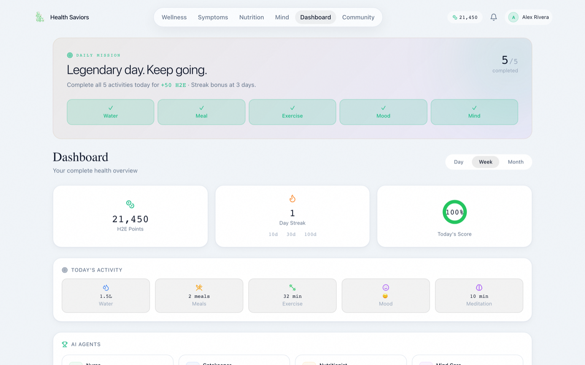
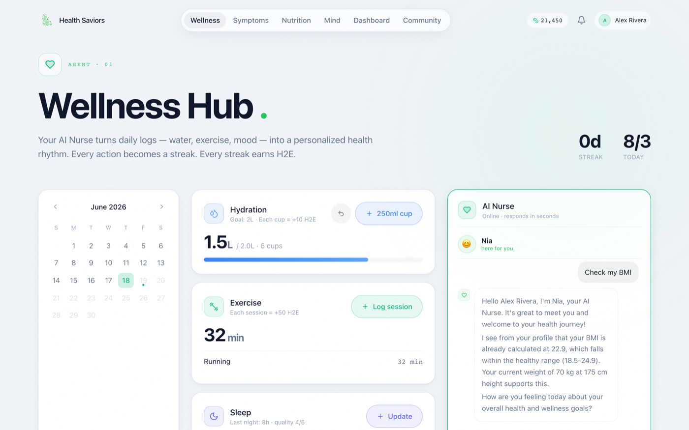
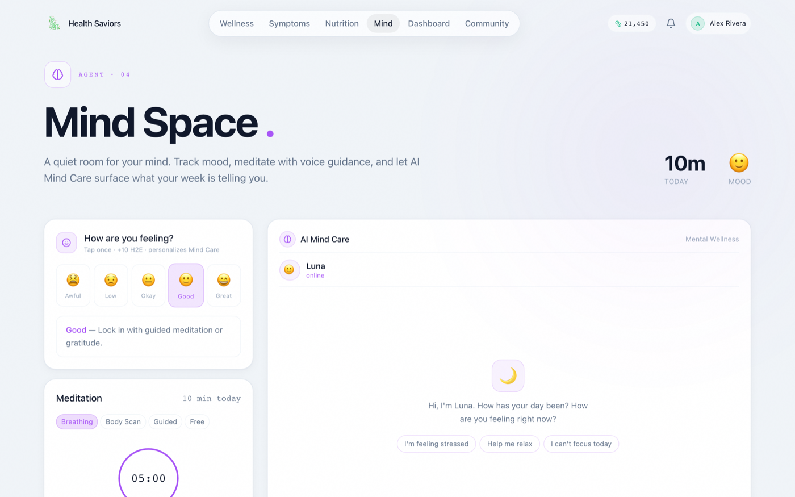
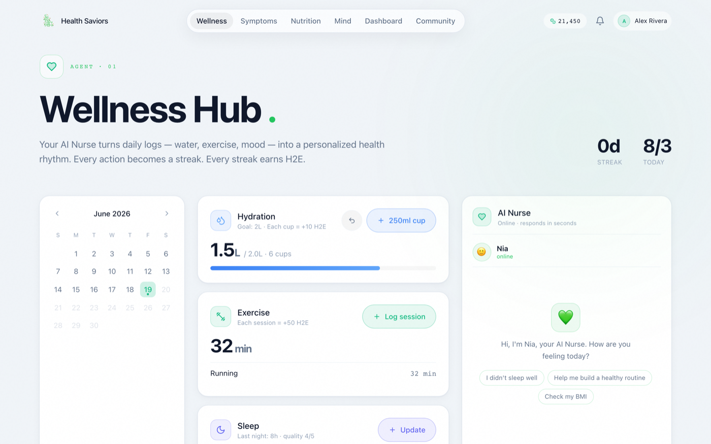
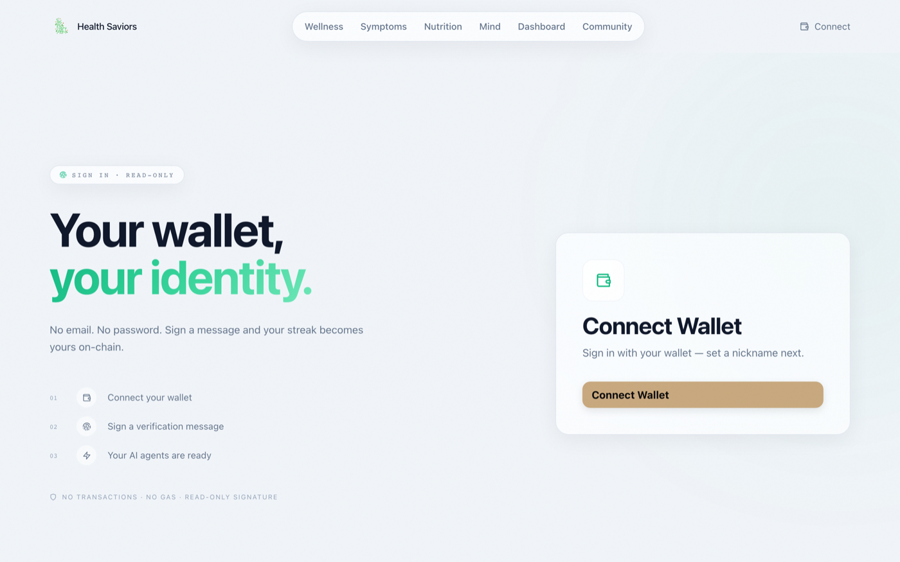
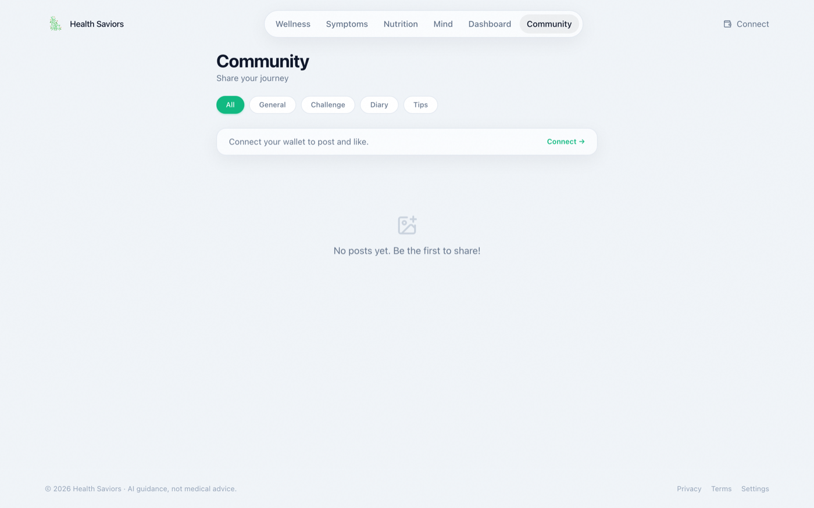
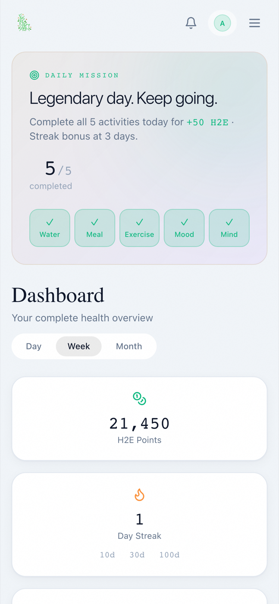
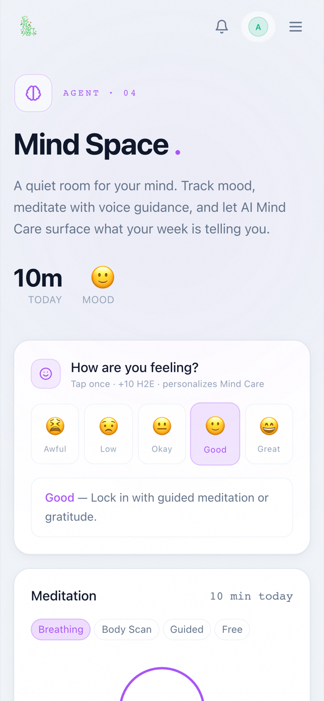
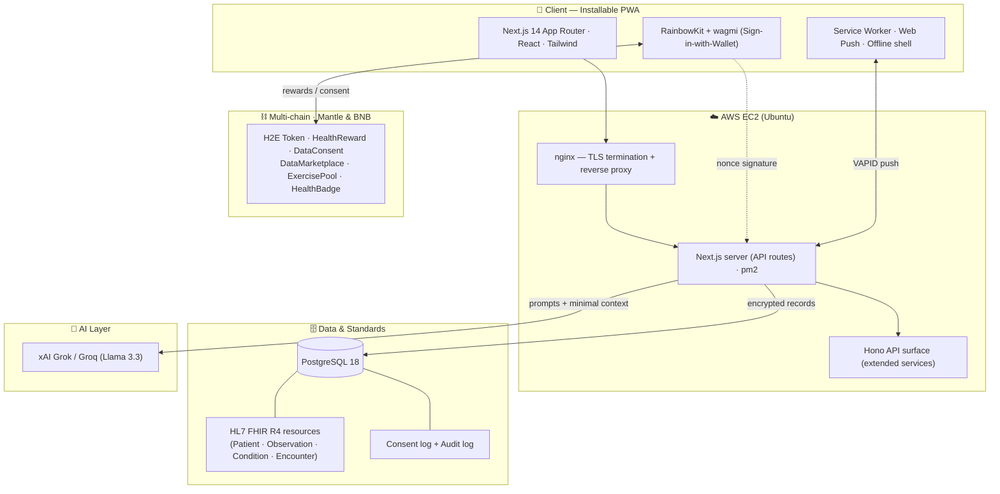

<div align="center">


# Health Saviors

### AI-Powered Health Companion with On-Chain Rewards

**Daily health journaling, four specialized AI health agents, and a Health-to-Earn (H2E) reward layer — wrapped in a fast, installable PWA.**

[](https://saviorofhealth.app)
[](https://nextjs.org)
[](https://www.typescriptlang.org)
[](https://www.postgresql.org)
[](https://www.mantle.xyz)
[](#-license)

[Live Demo](https://saviorofhealth.app) · [Features](#-features) · [Architecture](#-architecture) · [Tech Stack](#-tech-stack) · [Disclaimer](#️-medical-disclaimer--compliance)

</div>

---

## 📖 Overview

**Health Saviors** turns everyday health habits into a guided, rewarding experience. Users log their water, meals, exercise, sleep, mood, and meditation; chat with purpose-built AI health agents; and earn **H2E points** for consistency through a streak-based reward system. Wallet-based sign-in keeps onboarding frictionless and privacy-forward — no email or password required.

The app is shipped as an installable **Progressive Web App (PWA)** with push notifications, so reminders, streak rewards, and proactive agent check-ins reach users even when the app is closed.

> **Why it matters:** most health apps are passive trackers. Health Saviors pairs *behavioral nudges* + *clinically-informed AI guidance* + *aligned incentives* to actually move daily habits — while storing structured records in the **HL7 FHIR R4** standard for future interoperability.

---

## 🎬 Demo

**▶️ Live app:** **[saviorofhealth.app](https://saviorofhealth.app)** — sign in with a wallet to try the AI agents, daily logging, and rewards.


> _~18s walkthrough — populated dashboard → AI Nurse (Nia) live chat with a personalized reply → Mind Space._

### Screenshots

| Dashboard | AI Agent — live chat |
|:---:|:---:|
| [](docs/screenshots/dashboard.png) | [](docs/screenshots/agent-chat-live.png) |
| Daily streaks, H2E balance & a 100% activity ring | Named agents (Nia · Atlas · Sage · Luna) with reactive avatars + personalized replies |

| Mind Space | Daily logging |
|:---:|:---:|
| [](docs/screenshots/mindspace.png) | [](docs/screenshots/daily-log.png) |
| Guided breathing / meditation + availability-checked content | Water, meals (AI macro estimation), exercise, sleep, mood |

| Wallet sign-in | Community |
|:---:|:---:|
| [](docs/screenshots/login.png) | [](docs/screenshots/community.png) |

<div align="center"><sub>📱 Installable PWA — mobile</sub></div>

<div align="center">

&nbsp;&nbsp;

</div>

---

## ✨ Features

### 🤖 Four specialized AI health agents
Each agent has its own persona, scope, and clinical framework, and an expressive in-chat avatar that reacts to the conversation.

| Agent | Persona | Specialty | Grounded in |
|-------|---------|-----------|-------------|
| 💚 **Nia** | AI Nurse | Wellness & lifestyle coaching, daily check-ins | WHO activity guidelines, PSQI, PSS, motivational interviewing |
| 🩺 **Atlas** | Symptom Triage | Structured symptom assessment & care routing | OPQRST, ESI triage levels, red-flag detection |
| 🍎 **Sage** | Nutritionist | Personalized nutrition & meal analysis | Medical Nutrition Therapy, DASH, Mifflin-St Jeor |
| 🌙 **Luna** | Mind Care | Stress, mood & mental-wellness support | CBT, MBSR, PHQ/GAD-informed, crisis protocol |

- Personalized context: agents factor in age, BMI, chronic conditions, and past conversations.
- Safety-first: no diagnoses or prescriptions; built-in escalation to emergency/crisis resources.
- Natural meal logging: describe a meal in chat and it's auto-estimated (calories + macros) and saved to your diary.

### 📊 Daily health journaling
Water · Meals (AI calorie/macro estimation) · Exercise · Sleep · Mood · Meditation — with a charts dashboard for daily / weekly / monthly trends.

### 🔥 Health-to-Earn (H2E) rewards
Streak-based incentives (every 3 days, plus 10/30/100-day milestones) rather than spammy per-action points, designed to reward genuine consistency. Reward, consent, and badge logic is implemented as Solidity contracts across multiple chains — **Mantle & BNB Chain first**.

### 🔐 Wallet-based auth
Sign-in-with-wallet (RainbowKit + wagmi) using a nonce-signature challenge — no passwords, no email harvesting.

### 📱 PWA + push notifications
Installable app, offline shell, and Web-Push categories the user fully controls (rewards, reminders, agent follow-ups, community).

### 🧘 Mind Space & community
Guided breathing/meditation with curated (availability-checked) content, plus a community board with posts, comments, and likes.

---

## 🏗 Architecture



**Request path:** `Browser → nginx (80/443) → Next.js (pm2 :3000) → PostgreSQL + AI provider`. Health records are stored as FHIR R4 JSON (with AES-256-GCM encryption for sensitive raw payloads); every consent and access event is written to dedicated `consent_logs` / `audit_logs` tables.

---

## 🧰 Tech Stack

| Layer | Technologies |
|-------|--------------|
| **Frontend** | Next.js 14 (App Router), React 18, TypeScript, TailwindCSS, Framer Motion, Recharts |
| **Web3** | RainbowKit, wagmi v2, viem, ethers v6 — Mantle & BNB Chain (multi-chain, EVM) |
| **Backend / API** | Next.js Route Handlers, Hono, Prisma ORM |
| **Database** | PostgreSQL 18 (self-hosted) · Prisma schema · HL7 FHIR R4 |
| **AI / NLP** | xAI Grok & Groq (Llama 3.3 70B) via OpenAI-compatible SDK |
| **Smart Contracts** | Solidity 0.8, Foundry, OpenZeppelin (multi-chain — Mantle & BNB first) |
| **PWA / Notifications** | Service Worker, Web Push (VAPID), `web-push` |
| **Auth** | Sign-in-with-Wallet (nonce + signature), JWT sessions |
| **Infra / DevOps** | AWS EC2 (Ubuntu), nginx, pm2, Let's Encrypt, Turborepo monorepo |

---

## 📂 Repository Structure

```
ai-health-journal/                 # Turborepo monorepo
├── apps/
│   ├── web/                       # Next.js 14 PWA (primary app)
│   ├── api/                       # Hono service surface (extended features)
│   └── telegram-bot/              # Telegram delivery channel
├── packages/
│   ├── prisma/                    # DB schema (PostgreSQL) + FHIR models
│   ├── contracts/                 # Solidity contracts (multi-chain: Mantle & BNB)
│   ├── ai-scribe/                 # NLP → FHIR pipeline
│   ├── shared/                    # Shared types & utilities
│   └── education/                 # Learn-to-Earn content & reminders
└── infra/                         # Docker, CI/CD, monitoring
```

---

## 🚀 Getting Started

### Prerequisites
- Node.js ≥ 18.17 (Node 22 LTS recommended)
- PostgreSQL ≥ 14
- npm 10+

### Local development
```bash
# 1. Install dependencies
npm install --legacy-peer-deps

# 2. Configure environment (apps/web/.env.local)
#    DATABASE_URL, JWT_SECRET, GROQ_API_KEY / XAI_API_KEY,
#    NEXT_PUBLIC_WALLETCONNECT_PROJECT_ID

# 3. Create the database schema
cd packages/prisma && npx prisma db push && cd ../..

# 4. Run the dev server (web on :3000)
npm run dev
```

### Production (self-hosted, the way it runs today)
```bash
# Server: Ubuntu + Node 22 + PostgreSQL + nginx + pm2
cd apps/web && npm run build
pm2 start npm --name hs-web -- run start     # serves on :3000
# nginx reverse-proxies :80/:443 → :3000, TLS via Let's Encrypt (certbot)
```

### Smart contracts
```bash
cd packages/contracts
forge build
forge test -vvv
forge script script/Deploy.s.sol --rpc-url mantle_sepolia --broadcast
```

---

## 🗺 Roadmap

- [x] Wallet auth, AI agents, daily logging, H2E streak rewards, PWA + push
- [x] Self-hosted production (EC2 + PostgreSQL + nginx)
- [ ] On-chain reward settlement + Data Consent marketplace (opt-in, anonymized)
- [ ] My-Data export & provider hand-off (FHIR bundles)

---

## ⚠️ Medical Disclaimer & Compliance

> **Health Saviors is a wellness and educational tool — not a medical device, and not a substitute for professional medical advice, diagnosis, or treatment.**

- **Not medical advice.** AI agents provide general wellness information grounded in public clinical frameworks. They do **not** diagnose conditions, prescribe medication, or replace a licensed clinician. Always consult a qualified healthcare professional for medical concerns.
- **Emergencies.** The app is not for emergencies. If you are in crisis or facing a life-threatening situation, call your local emergency number (e.g., **911**) or a crisis line (e.g., **988** US Suicide & Crisis Lifeline) immediately.
- **Self-reported data.** Health entries are user-reported and may be unverified; AI nutrition/symptom estimates are approximate.
- **Privacy & consent.** Health data is treated as **sensitive personal data**. Processing is consent-based and logged (`consent_logs`), with access auditing (`audit_logs`). Sensitive records are encrypted (AES-256-GCM); data in transit is protected with TLS. We do **not** sell identifiable personal data.
- **Regulatory posture.** The project is designed to align with major privacy regimes — **GDPR** (EU, special-category health data → explicit consent), **US state health-privacy laws** (e.g., Washington *My Health My Data Act*), and **PIPA** (Korea, sensitive-information rules). Any third-party data sharing is **opt-in, purpose-limited, and pseudonymized/anonymized**. Production use in a given jurisdiction should be reviewed by qualified legal counsel.
- **No PHI on-chain.** Personal health information is never written to the blockchain; only reward/consent state and non-identifying references are recorded on-chain.

*Use of this application constitutes acknowledgement of the above. See in-app [Privacy Policy](https://saviorofhealth.app/privacy) and [Terms of Service](https://saviorofhealth.app/terms).*

---

## 📜 License

Proprietary — © Health Saviors. All rights reserved. Contact the maintainers for usage, evaluation, or partnership inquiries.

<div align="center">
<sub>Built with Next.js, PostgreSQL, and EVM contracts (Mantle & BNB) · Health-to-Earn for everyday wellness</sub>
</div>
